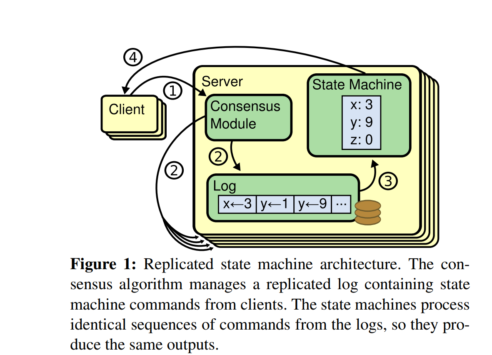

# Consensus Overview

## Purpose: Why do Consensus Algorithms Exist?

Consensus algorithms allow a group of machines or servers to operate as one coherent system even when some machines or servers fail.

In the Raft paper by Diego et al., consensus is presented through the replicated state machine model. Each server maintains a replicated log, and each state machine executes the same commands in the same order.

## Key Idea

Consensus is not only about agreement. It is about agreeing on the same ordered history of commands.

## Why This Matters

If different machines apply different commands, or apply the same commands in different orders, the system becomes inconsistent.

## Figure Reference

See Figure 1 below.

 It shows the replicated state machine architecture.

## How Replicated State Machines Work

- Clients submit commands.
  - A client sends a request to the distributed system, such as creating an account, updating a value, or transferring money.

- The consensus module manages the replicated log.
  - The replicated log is the ordered list of commands that every server must eventually share.
  - The consensus module decides which commands are accepted, where each command appears in the log, and when a command is safe to commit.
  - Its purpose is to make sure that all non-faulty servers agree on the same command sequence, even if messages are delayed or some servers fail.
  - In Raft, the leader receives client commands, appends them to its own log, and coordinates with follower servers so they store the same entries in the same order.

- Each server applies log entries to its state machine.
  - After a log entry is committed, each server executes the command in its local state machine.

- Identical logs lead to identical outputs.
  - If all servers execute the same commands in the same order, they will produce the same results.

## Blockchain Relevance

Blockchain systems also rely on replicated state and ordered histories. Instead of only thinking about blocks, I should think about the deeper problem: how distributed nodes agree on the same sequence of state transitions.

## Key Terms

- Consensus
- Replicated log
- Replicated state machine
- Deterministic execution
- Fault tolerance
- Safety
- Availability

## Research Reflection

As a blockchain researcher, I should understand Raft and Paxos as foundational distributed consensus algorithms. Even when a blockchain uses a different consensus model, the core ideas of ordering, replication, fault tolerance, and safety still apply.

## Note

Raft is a consensus algorithm for managing a replicated log.
