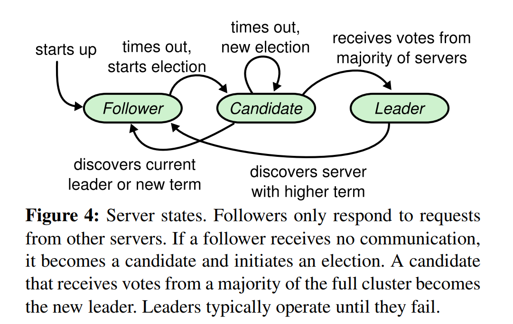
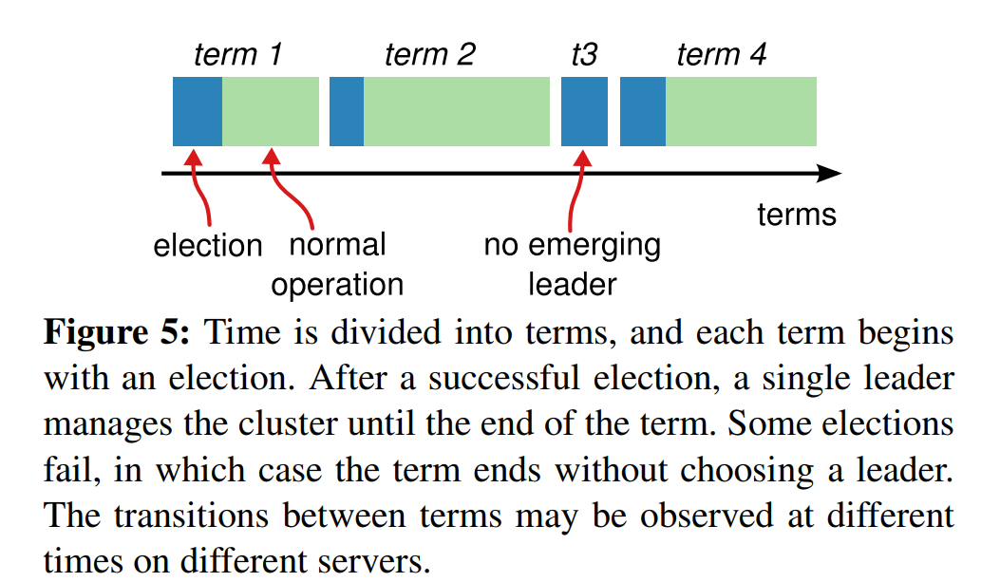
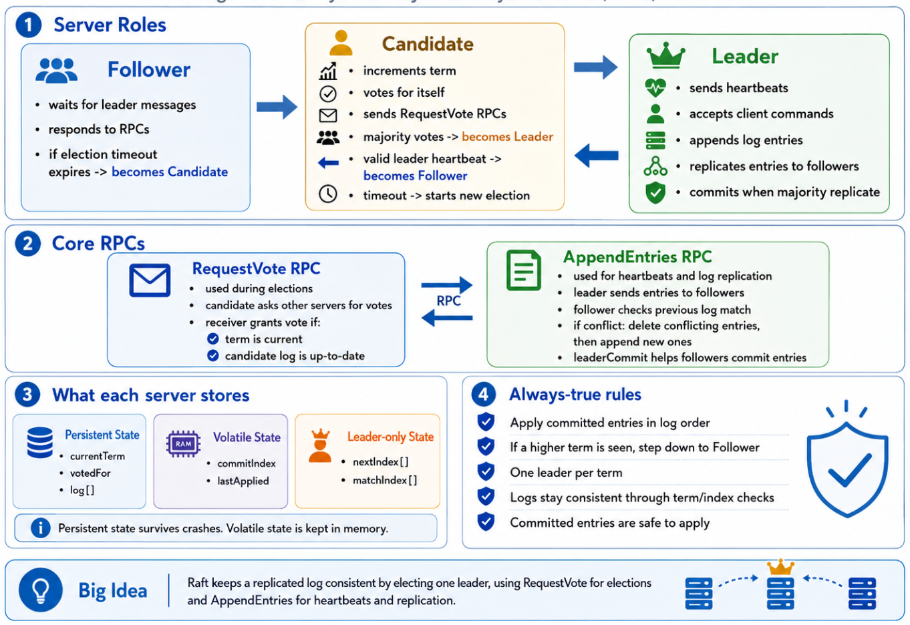

# Raft Basics and Leader Election

## Purpose: How does Raft organize the System and choose a leader?

Raft uses a leader-based design. Instead of allowing all servers to coordinate equally, Raft elects a leader that manages the replicated log.

## Server States

Raft servers can be in one of three states:

1. Follower
2. Candidate
3. Leader

In normal operation, there is one leader who handles client requests while the other servers act as followers. If followers stop hearing from the leader, they become candidates and start an election.

## Terms

Raft divides time into terms. Each term begins with an election.

A term may have:

- A successful election, where one leader is chosen.
- A failed election, where no leader is chosen because of a split vote, this prompts a new term to begins.

Terms help servers identify stale leaders and outdated messages, and so they act as a logical clock.

## Leader Election Process

1. Servers begin as followers.
2. A leader sends periodic heartbeats (a small message that tells followers I am still the leader. Do not start a new election) to followers to show they are still active.
3. If a follower does not hear from a leader before its election timeout expires, it becomes a candidate.
   - The election timeout is the maximum amount of time a follower waits to receive communication from the current leader (In Raft, election timeouts are usually randomized across servers).
   - Every time a follower receives a valid heartbeat, it resets its election timeout.
   - If the timer expires before another heartbeat arrives, the follower assumes the leader may have failed.
   - The follower then becomes a candidate and starts a new election.
4. The candidate increments its term.
   - A term is Raft’s way of numbering election rounds.
   - When a follower becomes a candidate, it starts a new election by increasing the current term by 1.
   - This new term tells the other servers that a fresh election has begun.
   - Servers use term numbers to identify newer leadership information and reject outdated messages from older terms.
5. The candidate votes for itself.
   - Since the candidate is one of the servers in the cluster, it is allowed to cast one vote.
   - It votes for itself first because it is actively trying to become the leader.
   - This self-vote counts toward the majority needed to win the election.
   - The candidate then asks the other servers for their votes using RequestVote RPCs.
6. The candidate sends RequestVote Remote Procedure Calls (RPCs) to other servers.
   - It is a way for one server to request an action or response from another server.
   - In Raft, a RequestVote RPC is the message a candidate sends to ask other servers for their vote.
   - Each server checks the request and decides whether to grant or reject the vote.
7. If it receives votes from a majority, it becomes leader.
8. The new leader sends heartbeats to establish authority.

## Why Majority Voting Matters

A majority vote is required to elect a leader because any two majority groups in the same cluster must overlap. 
This means they must share at least one server. 
Since each server can vote for only one candidate in a given term, the overlap prevents two candidates from both receiving a valid majority in the same term. 
As a result, Raft ensures that only one leader can be elected per term.

## Randomized Election Timeout

Raft uses randomized election timeouts to reduce split votes.

If all servers timed out at the same time, multiple candidates could start elections together. Randomization makes it more likely that one server times out first, becomes candidate, and wins before others begin elections.

This helps prevent all followers from becoming candidates at the exact same time, which would cause repeated split votes

## Figure References

- Figure 4 shows the transition between follower, candidate, and leader.

Source: Ongaro, Diego, and John Ousterhout. "In search of an understandable consensus algorithm." 2014 USENIX annual technical conference (USENIX ATC 14). 2014.

- Figure 5 shows how time is divided into terms.

Source: Ongaro, Diego, and John Ousterhout. "In search of an understandable consensus algorithm." 2014 USENIX annual technical conference (USENIX ATC 14). 2014.

- Figure 2 summarizes the RequestVote RPC and server behavior.

Source: AI generated

## Blockchain Relevance

Leader election is relevant to blockchain systems that use leader-based consensus, rotating proposers, sequencers, validators, or ordering nodes. Even when the terminology differs, the core issue is similar: one party may temporarily coordinate ordering, but the system must remain safe if that party fails.

## Questions to Review

- What causes a follower to become a candidate?
- Why does a candidate vote for itself?
- Why is a majority required?
- How does Raft prevent two leaders in the same term?
- What problem does randomized timeout solve?