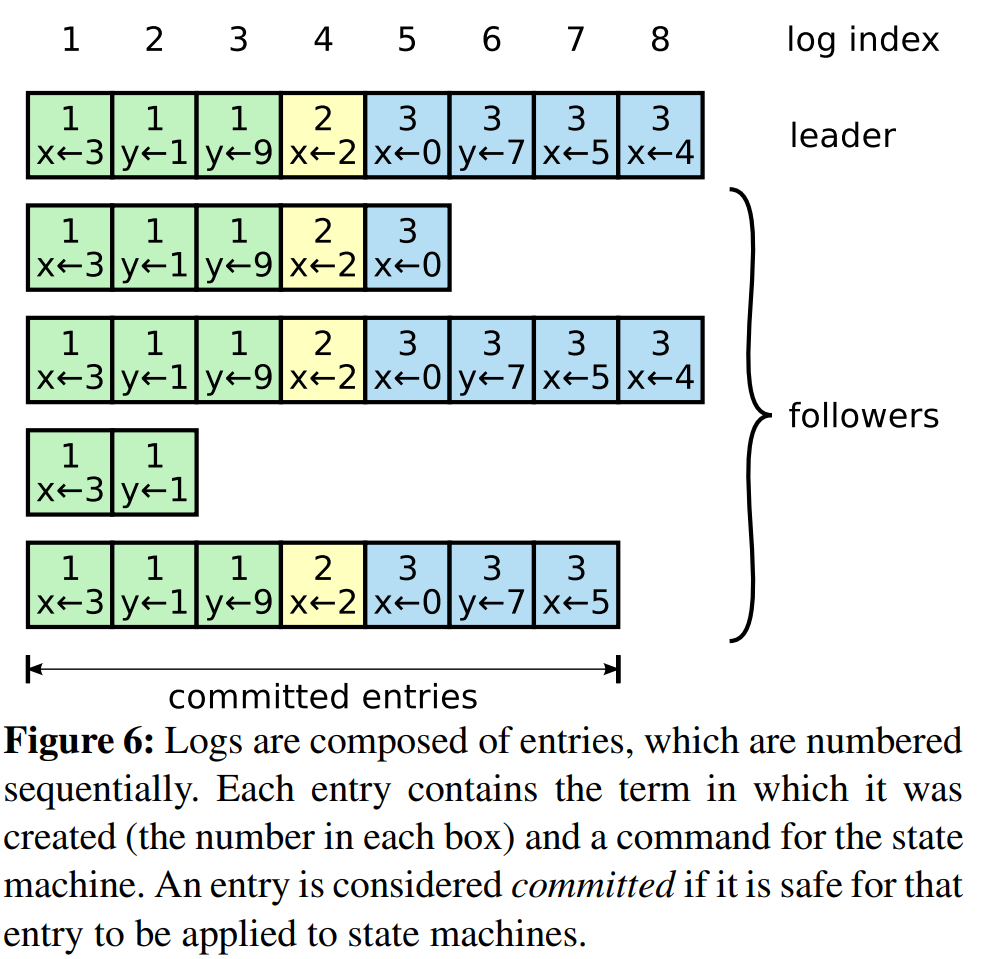
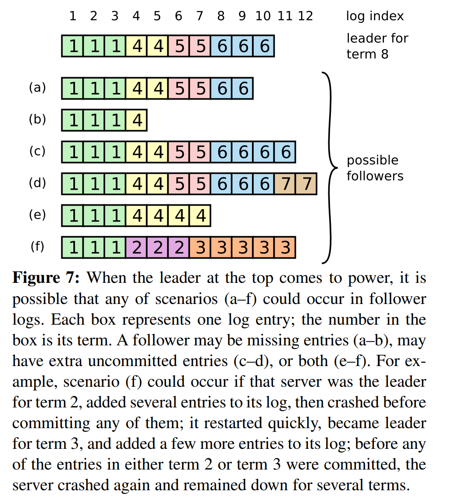

# Raft Log Replication

## Purpose: How does Raft Keep logs consistent across servers?

Log replication is the process by which the Raft leader ensures that all servers eventually store the same log entries in the same order.

## Basic Flow

## Log Replication in Raft

Once a leader has been elected, it becomes responsible for handling client requests and keeping the replicated log consistent across the cluster. The leader is the only server that directly accepts client commands and decides where new entries should be placed in the log. This simplifies the system because log entries flow in one direction: from the leader to the followers.

1. A client sends a command to the leader.
   - A client request contains a command that should be executed by the replicated state machine.
   - For example, the command could be to update a value, create a record, or perform a transaction.
   - If a client contacts a follower instead of the leader, the follower redirects the client to the leader.

2. The leader appends the command to its own log.
   - The leader first records the command as a new log entry in its own local log.
   - This entry contains the command, the current term, and the entry’s position/index in the log.
   - At this point, the entry is not yet committed. It has only been accepted by the leader.

3. The leader sends AppendEntries RPCs to followers.
   - The leader then sends `AppendEntries` RPCs to the other servers.
   - These RPCs are used to replicate the new log entry.
   - The same RPC is also used for heartbeat messages when there are no new entries to send.

4. Followers append the entry if it is consistent with their logs.
   - Before accepting the new entry, each follower checks whether its log matches the leader’s log at the previous entry.
   - The leader sends the previous log index and previous log term.
   - If the follower has a matching previous entry, it accepts and appends the new entry.
   - If the follower’s log does not match, it rejects the request, and the leader retries from an earlier point until the logs match.

5. Once the entry is stored on a majority of servers, the leader considers it committed.
   - A log entry is considered committed when it has been safely replicated on a majority of the servers.
   - For example, in a five-server cluster, the entry must be stored on at least three servers.
   - Majority replication is important because it ensures the entry will not be lost even if some servers fail.

6. The leader applies the committed entry to its state machine.
   - After the entry is committed, the leader executes the command in its own state machine.
   - The state machine is the part of the system that actually changes the application state.
   - For example, if the command is `set x = 5`, the state machine performs that update.

7. Followers eventually learn the committed index and apply the entry too.
   - The leader includes its latest committed index, called `leaderCommit`, in future `AppendEntries` RPCs.
   - When followers learn that an entry has been committed, they apply it to their own state machines in log order.
   - This ensures that all servers eventually execute the same commands in the same order.

## Important Concepts

### What a Log Entry Contains

In Raft, the replicated log is the main structure used to keep all servers consistent. Each server stores a log, and the goal of the consensus algorithm is to make sure that all non-faulty servers eventually contain the same log entries in the same order.

A log entry contains three important pieces of information:

- The command for the state machine. (The command is the actual operation that the system needs to execute. For example, in a key-value store, a command might be: set x = 5 or transfer $50 from Account A to Account B)
- The term in which the entry was created.
- The index of the entry in the log.

### Commit Index

The commit index identifies the highest log entry known to be committed.

### AppendEntries RPC

AppendEntries is used for two purposes:

1. Sending new log entries.
2. Sending heartbeats when there are no new entries.

AppendEntries works like a checkpoint system. Before adding new log entries, the follower checks whether its previous entry matches the leader’s previous entry. If the checkpoint matches, the new entries can be added. If the checkpoint does not match, the follower refuses the request, and the leader tries again from an earlier point.

## Log Consistency

Raft checks whether a follower’s log matches the leader’s log before appending new entries.

The leader sends:

- The index of the previous log entry.
- The term of the previous log entry.
- The new entries to append.

If the follower does not have a matching previous entry, it rejects the request.

## What Happens When an AppendEntries Request Is Rejected?

If a follower does not have a matching previous log entry, it rejects the leader’s `AppendEntries` request. This means the follower is telling the leader:

> “My log does not match yours at the point you are trying to continue from.”

When this happens, the leader adjusts its tracking information for that follower and retries.

For each follower, the leader keeps a value called `nextIndex`. This tells the leader the next log entry it should send to that follower. If the follower rejects an `AppendEntries` request because of a log inconsistency, the leader decreases that follower’s `nextIndex` and sends another `AppendEntries` request using an earlier log position.

This process continues until the leader finds the most recent point where the follower’s log and the leader’s log agree. Once a matching point is found, the follower accepts the request. The follower then deletes any conflicting entries after that point and appends the new entries from the leader.

In simple terms, the leader “rewinds” and retries until it finds where the two logs match.

## Handling Inconsistent Logs

Follower logs may become inconsistent after crashes or leader changes.

A follower may:

- Be missing entries.
- Have extra uncommitted entries.
- Have both missing and extra entries.

The leader fixes this by finding the latest point where the follower’s log matches the leader’s log, deleting conflicting entries after that point, and sending the correct entries.

## Figure References

- Figure 6 shows how logs are organized by index and term.

Source: Ongaro, Diego, and John Ousterhout. "In search of an understandable consensus algorithm." 2014 USENIX annual technical conference (USENIX ATC 14). 2014.

- Figure 7 shows possible follower log inconsistencies after leader changes.

Source: Ongaro, Diego, and John Ousterhout. "In search of an understandable consensus algorithm." 2014 USENIX annual technical conference (USENIX ATC 14). 2014.

## Blockchain Relevance

This is closely related to blockchain ordering. A blockchain also maintains an ordered sequence of state transitions. Raft’s replicated log is not identical to a blockchain, but the conceptual goal is similar: all honest replicas should agree on the same ordered history.

## Why does the leader never overwrite its own log?

In Raft, a leader never overwrites or deletes entries in its own log. It only appends new entries. This is called the **Leader Append-Only Property**.

The reason is that once a server becomes leader, Raft assumes that its log is safe to use as the reference log for that term. The leader then forces follower logs to become consistent with its own log. If a follower has missing entries, the leader sends them. If a follower has conflicting entries, the follower deletes those conflicting entries and replaces them with entries from the leader.

Raft limits the ways logs can change and makes it easier to guarantee that committed entries are preserved.

This design makes Raft easier to reason about because log repair only moves in one direction:

Leader log → Follower logs

The leader does not ask followers what its log should look like. Instead, followers are adjusted until they match the leader. The leader never overwrites its own log because Raft uses the leader’s log as the authoritative log for that term. Followers must adjust their logs to match the leader, while the leader only appends new entries. This protects committed entries, simplifies log repair, and supports Raft’s safety guarantees.

## Key Questions

- When is a log entry committed?
- Why does Raft require majority replication?
- What happens if a follower has conflicting entries?
- Why does the leader never overwrite its own log?
- How does AppendEntries preserve consistency?

