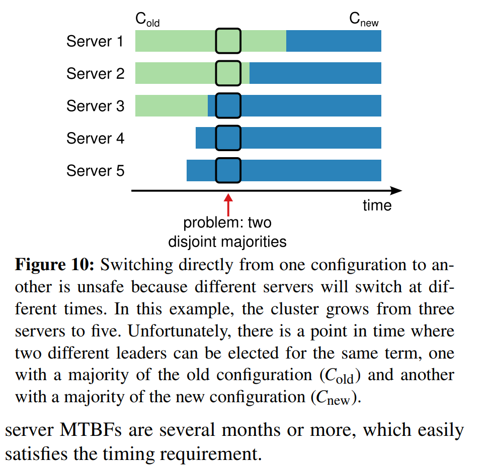
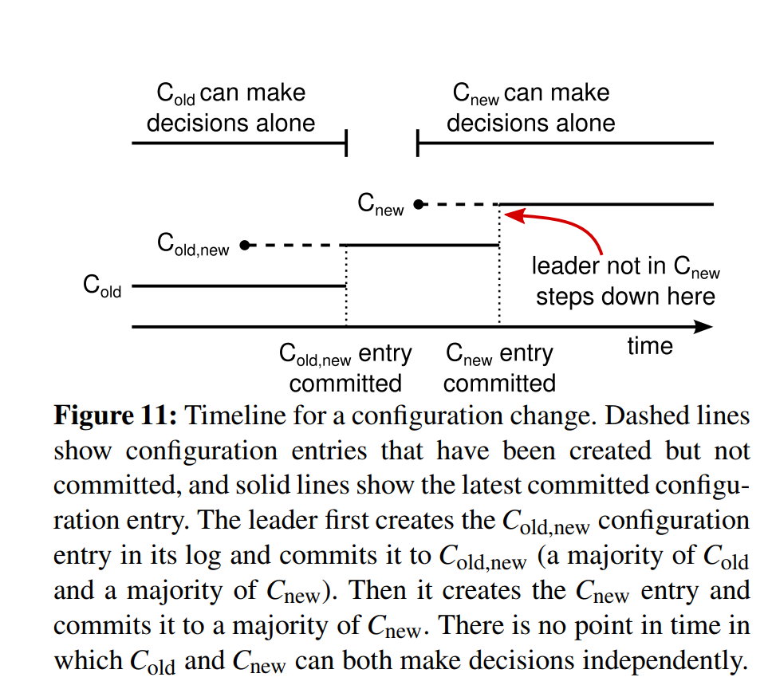
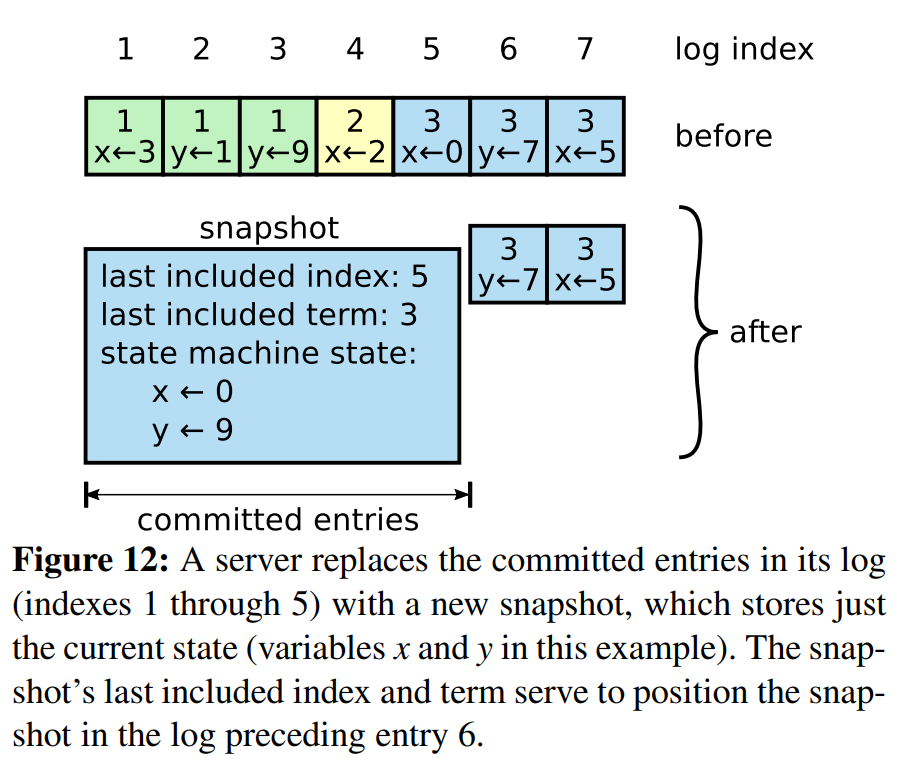
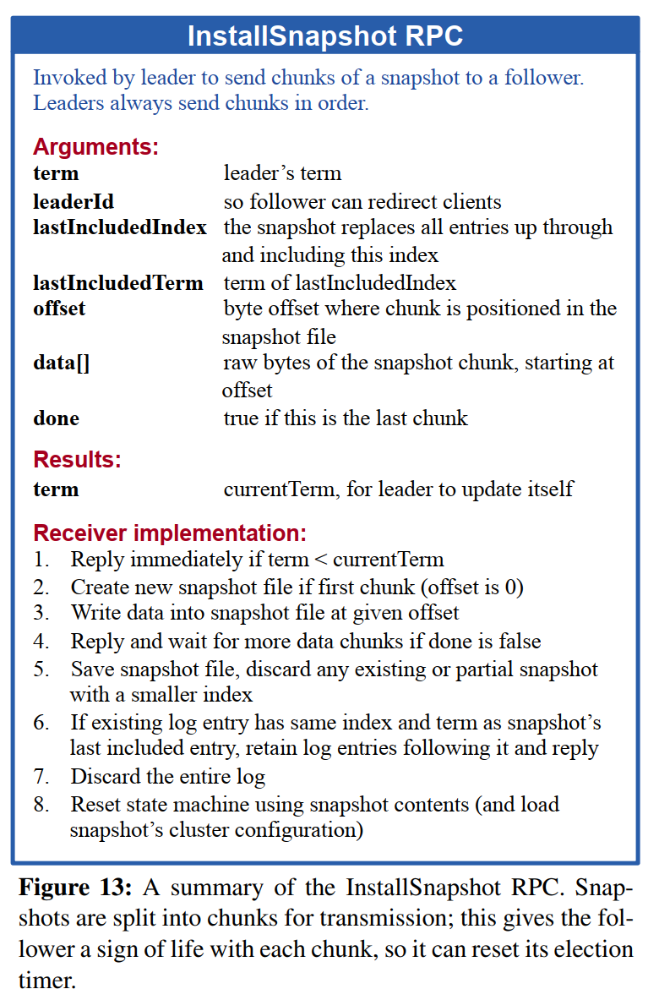

# Raft Practical Systems View

## Purpose

The practical sections explain how Raft handles real-world system concerns beyond the basic algorithm.

These include:

- Follower and candidate crashes
- Timing and availability
- Cluster membership changes
- Log compaction
- Client interaction

## Timing and Availability

Raft safety does not depend on timing, but timing affects availability. Delays or slow machines should not cause incorrect results.

However, availability does depend on timing. If messages are too slow or failures happen too frequently, Raft may struggle to elect and maintain a stable leader.

## Timing Relationship

The paper by Diego et al. gives the following relationship and shows how Raft maintains availabiity:

broadcastTime << electionTimeout << MTBF

This means broadcast time should be much smaller than election timeout,
and election timeout should be much smaller than mean time between failures (MTBF).

Where:

- broadcastTime is the time to send RPCs to the other servers in the cluster and receive their responses (how long it takes for servers to communicate with each other).
- electionTimeout is the time before a follower starts a new election (how long a follower waits before starting an election).
- MTBF is the mean time between failures (how long the system usually runs before another server failure happens, or the average amount of time expected between server failures). 
If failures happen very frequently, the system may struggle to elect and maintain a stable leader. If failures are rare, Raft has enough time to elect leaders and replicate log entries normally.

### broadcastTime << electionTimeout

This means the time needed to send messages across the cluster should be much shorter than the election timeout.

Why? Because the leader must have enough time to send heartbeats to followers before they mistakenly think the leader has failed.

If the election timeout is too short, followers may start unnecessary elections even though the leader is still alive.

### electionTimeout << MTBF

This means the election timeout should be much shorter than the average time between failures.

Why? Because when a leader actually fails, the system should not wait too long before choosing a new leader. The cluster should recover quickly compared to how often failures occur.

### Timing Summary
## 1. Server communication should be fast.

This means servers should be able to send messages to each other quickly.

In Raft, the leader must regularly send heartbeats to followers. These heartbeats are sent using Remote Procedure Calls, or RPCs. If communication is fast, followers receive the leader’s heartbeat before their election timers expire.

Example:

If it takes only 10 milliseconds for the leader to send heartbeats and receive responses, and the election timeout is 200 milliseconds, then the leader has enough time to communicate before followers panic and start a new election.

So this line means:

> The network and server response time should be much faster than the election timeout.

## 2. Leader election timeout should be long enough to avoid false elections.

A false election happens when followers start a new election even though the leader has not actually failed.

This can happen if the election timeout is too short.

Example:

Suppose the leader is alive, but the network is slightly slow. If a follower waits only 20 milliseconds before timing out, it may wrongly assume the leader is dead and start an election.

That would create unnecessary instability.

So the election timeout should be long enough to allow normal heartbeat messages to arrive.

In simple terms:

> Do not make followers too impatient.

## 3. Leader election timeout should also be short enough to recover quickly from real failures.

The election timeout should not be too long either.

If the leader really crashes, followers need to notice and elect a new leader quickly. If the election timeout is too long, the system waits too long before recovering.

Example:

If the leader crashes and the election timeout is 10 seconds, the cluster may sit idle for about 10 seconds before starting a new election.

But if the election timeout is 200 milliseconds, the cluster can detect the failure and begin recovery much faster.

So this line means:

> Do not make followers wait too long when the leader is actually gone.

## 4. Failures should be rare enough that the system can make progress between them.

This means servers should not be failing so frequently that Raft never gets enough stable time to elect a leader and replicate log entries.

Example:

If a server fails every few milliseconds, but elections and log replication take longer than that, the system may keep restarting elections and never make progress.

Raft works best when failures happen occasionally, not continuously.

So this line means:

> The system needs enough calm time between failures to elect a leader, replicate entries, and serve clients.

## Membership Changes in Raft

Raft supports changing the set of servers in a cluster. This is called **cluster membership change** or **configuration change**.

A cluster configuration defines which servers are currently part of the Raft group.

For example, an old configuration may have three servers:

Old configuration:
S1, S2, S3

Later, the system may need to add more servers:
New configuration:
S1, S2, S3, S4, S5

This kind of change is necessary in real systems because servers may fail, new machines may be added, old machines may be removed, or the system may need more replication capacity.

### Why direct membership change is unsafe

Changing directly from the old configuration to the new configuration can be unsafe because not all servers switch at the exact same time.

Some servers may still believe the cluster is using the old configuration, while others may believe the cluster is using the new configuration.

This can create a dangerous situation where two different groups each think they have a valid majority.

For example:

Old configuration:
S1, S2, S3

Majority of old configuration = 2 servers
New configuration:
S1, S2, S3, S4, S5

Majority of new configuration = 3 servers

During the transition, one group of servers might form a majority under the old configuration, while another group forms a majority under the new configuration.

That means two leaders could be elected, or two conflicting decisions could be made. This would violate Raft’s safety guarantees.

The paper explains that switching directly from one configuration to another is unsafe because servers cannot all change configurations atomically at the same instant. Different servers may switch at different times, which can allow independent majorities to form.

## Joint Consensus
To avoid this problem, Raft uses joint consensus.

Joint consensus is a temporary transition phase where the cluster uses both the old configuration and the new configuration together.

During joint consensus, decisions require agreement from:

A majority of the old configuration.
A majority of the new configuration.

This ensures that the system does not split into two independent decision-making groups.

Because every important decision must be approved by both the old and new configurations, neither configuration can act completely on its own.

This creates overlap between the two configurations and ensures that only one safe decision-making path exists during the membership change.

## Log Compaction (Log Growth and Snapshotting in Raft)

## Log Growth and Snapshotting in Raft

Raft uses a replicated log to keep servers consistent. Every client command that changes the system is added to the log, replicated, committed, and eventually applied to the state machine.

Over time, this log keeps growing.

For example:

Index 1: create account
Index 2: deposit $50
Index 3: update balance
Index 4: withdraw $10
Index 5: change configuration
...
Index 10,000: update record

If the log is allowed to grow forever, it can become too large and inefficient. So practical systems need a way to reduce log size.

### Why log growth is a problem

A growing log creates several practical problems:

It consumes more storage.
It takes longer to replay the log when a server restarts.
It can slow down recovery after crashes.
It can make it harder for new or lagging servers to catch up.

This is why practical Raft systems need a way to reduce the size of the log without losing the current system state.

Raft uses snapshotting. A snapshot stores the current state, allowing old committed log entries to be discarded.

### What snapshotting does

Raft uses snapshotting as a log compaction technique. Snapshotting makes Raft practical for real systems. Without snapshotting, logs would grow without limit. A server that crashes and restarts might need to replay a huge number of log entries before becoming useful again. A new server joining the cluster might also take too long to catch up.

Snapshotting solves this by keeping the current state compact and reducing the amount of old history each server must store.

A snapshot is a saved copy of the current state of the state machine at a particular point in the log.

Instead of keeping every old command forever, the server saves the result of applying those commands.

For example, instead of keeping:

Index 1: set x = 1
Index 2: set y = 2
Index 3: set x = 5
Index 4: set y = 9

The system can store a snapshot like:

Current state:
x = 5
y = 9

Once the snapshot safely captures the state up to a certain log index, the old committed log entries before that point can be discarded.

#### What the snapshot contains

In Raft, a snapshot contains:

The current state of the state machine.
The index of the last log entry included in the snapshot.
The term of the last log entry included in the snapshot.
The latest cluster configuration known at that point.

The last included index and term are important because Raft still needs to maintain log consistency after the snapshot. They help the server know where the snapshot fits in the log history.

Suppose a server has applied log entries 1 through 5:

Log:
Index 1
Index 2
Index 3
Index 4
Index 5
Index 6
Index 7

If entries 1 through 5 have already been committed and applied, the server can create a snapshot of the state after index 5.

Then the server can discard entries 1 through 5 and keep:

Snapshot:
State after index 5
Last included index = 5
Last included term = term of index 5

Remaining log:
Index 6
Index 7

This reduces storage while preserving the information needed to continue operating safely.

#### Why this is safe

Snapshotting is safe because it only removes log entries that have already been committed and applied to the state machine.

The system is not forgetting the effect of those entries. It is replacing many old commands with one compact representation of the current state.

Old log entries explain how we got here.
The snapshot records where we are now.
In summary: Raft logs grow as client commands are added over time. If the logs grow forever, they consume storage and make recovery slower. Snapshotting solves this by saving the current state of the state machine and discarding old committed log entries that are already reflected in that state. The snapshot includes metadata such as the last included index and term so Raft can preserve log consistency. If a follower falls too far behind, the leader can send it a snapshot to help it catch up.

### What happens if a follower is far behind?

Sometimes a follower may be so far behind that the leader no longer has the old log entries the follower needs. This can happen if the leader has already discarded those entries after snapshotting.

In that case, the leader sends the follower a snapshot.

Raft uses an InstallSnapshot Remote Procedure Call for this. The leader sends the snapshot to the lagging follower, and the follower uses it to catch up to the current state.

After installing the snapshot, the follower can continue receiving newer log entries from the leader.

## Client Interaction

Clients send requests to the leader. If they contact a follower, the follower redirects them to the leader.

Raft also handles duplicate client commands by using unique serial numbers so that commands are not executed more than once.

## Figure References

- Figure 10 shows why directly switching configurations can be unsafe.

- Figure 11 shows the joint consensus process.

- Figure 12 shows how snapshots replace older log entries.

- Figure 13 summarizes the InstallSnapshot RPC.

## Blockchain Relevance

This phase is useful for understanding validator-set changes, node failures, leader replacement, state snapshots, and long-running distributed ledgers.

## Key Questions

### Why does availability depend on timing?

Availability means the system can continue responding to clients. In Raft, the system needs enough timing stability to elect and maintain a leader. If messages are too slow or failures happen too frequently, followers may keep starting elections, leaders may not stay active long enough, and the cluster may stop making progress. Raft’s **safety** does not depend on timing, but its ability to remain available does. :contentReference[oaicite:0]{index=0}

### Why is direct membership change unsafe?

Directly switching from an old cluster configuration to a new one is unsafe because servers may not switch at the same time. Some servers may still use the old configuration while others use the new one. This can allow two separate majorities to form, which could lead to two leaders or conflicting decisions in the same term.

### How does joint consensus solve the configuration-change problem?

Joint consensus creates a temporary transition phase where both the old and new configurations are active together. During this phase, decisions require agreement from a majority of the old configuration and a majority of the new configuration. This prevents either group from acting independently and avoids split decision-making.

### Why is log compaction necessary?

Log compaction is necessary because Raft logs grow over time as client commands are added. If logs grow forever, they consume storage and slow down recovery because servers may need to replay too many old entries after restarting. Snapshotting reduces log size by saving the current state and discarding old committed log entries already reflected in that state.

### How does Raft avoid executing the same client command twice?

Raft avoids duplicate execution by having clients attach unique serial numbers to commands. The state machine records the latest serial number processed for each client and stores the response. If the same command is received again, Raft returns the previous response instead of executing the command a second time.