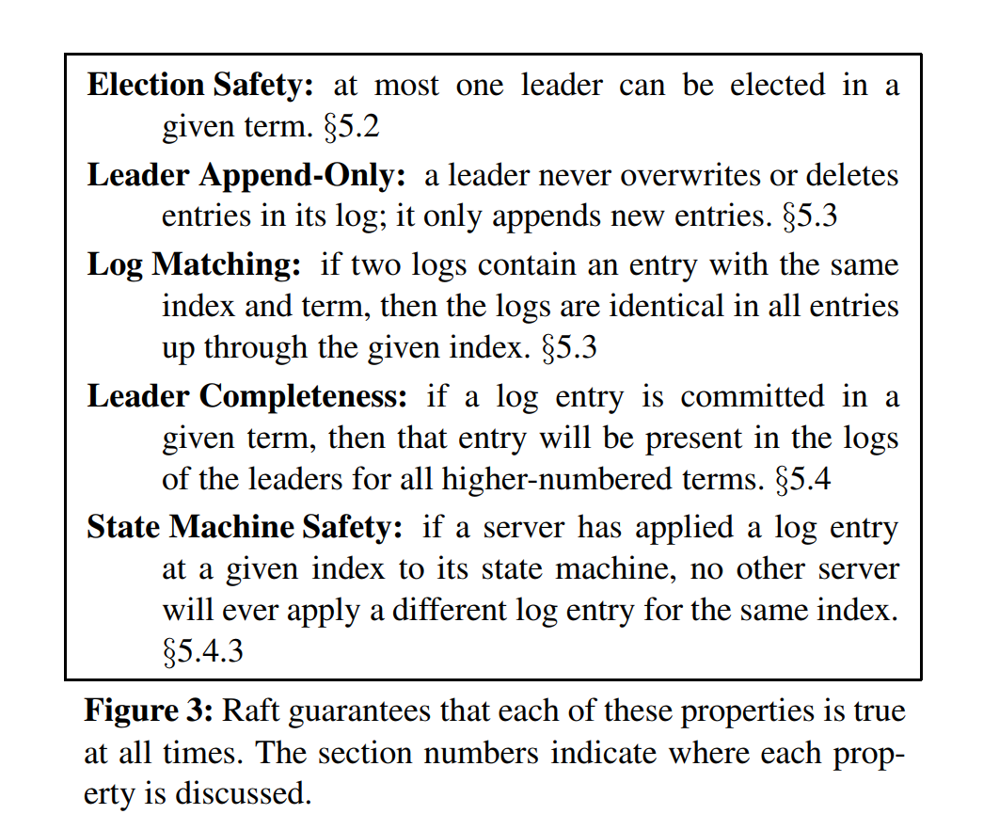
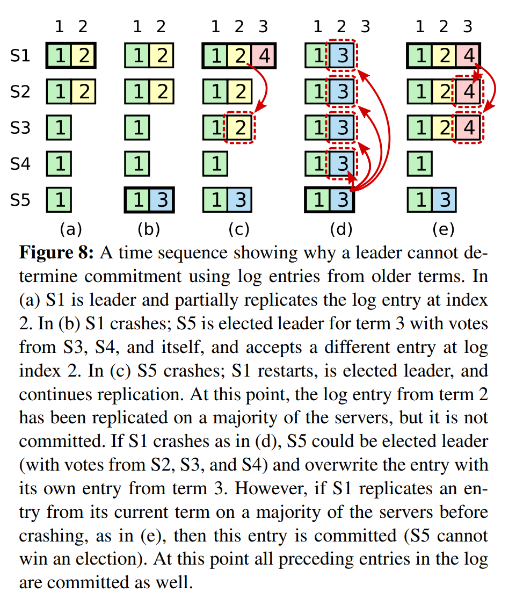
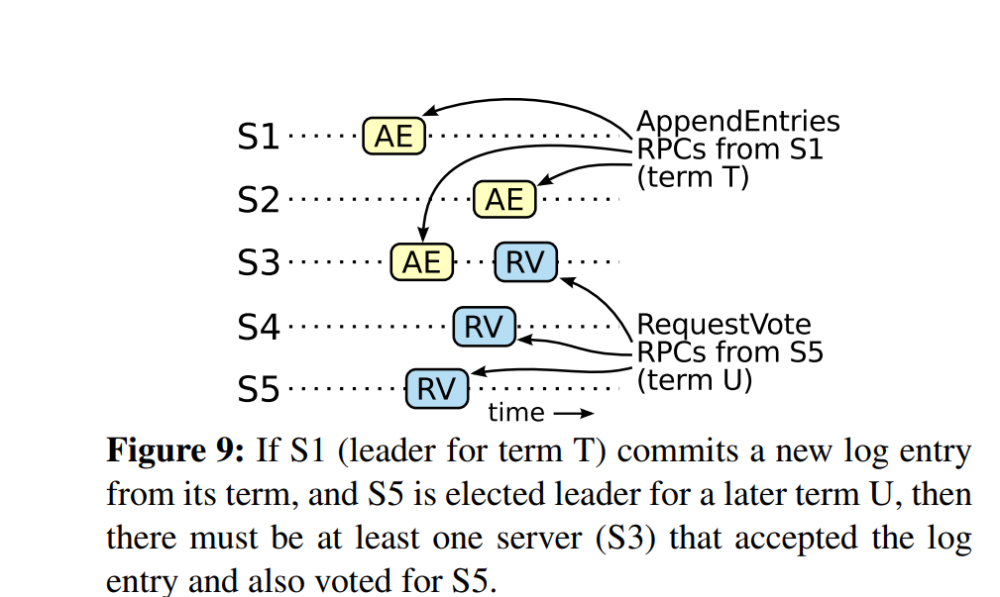

# Raft Safety

## Purpose: Why does Raft not lose or overwrite committed entries?

Safety ensures that Raft never produces an incorrect result, even during failures, delays, crashes, and leader changes.

The key safety question is:

Can two servers apply different commands at the same log index?

Raft’s answer must be no.

## Core Safety Properties

Figure 3 lists the main Raft safety properties:

1. Election Safety
2. Leader Append-Only
3. Log Matching
4. Leader Completeness
5. State Machine Safety

## Election Safety

At most one leader can be elected in a given term.

This is enforced through majority voting. Since two majorities must overlap, two candidates cannot both receive a majority in the same term.

## Leader Append-Only

A leader never overwrites or deletes entries in its own log. It only appends new entries.

## Log Matching

If two logs contain an entry with the same index and term, then the logs are identical up through that entry.

This property is maintained through the AppendEntries consistency check.

Raft’s log consistency rules ensure that if a current leader successfully commits an entry from its own term, then future leaders must contain that committed entry. And because logs are ordered, the earlier entries before it are also preserved.

## Leader Completeness

If a log entry is committed in a given term, that entry must appear in the logs of all future leaders.

This is one of the most important safety ideas in Raft.

## State Machine Safety

If one server applies a log entry at a given index, no other server should ever apply a different command at that same index.

## Election Restriction

Raft prevents unsafe leaders by requiring voters to compare their logs with a candidate’s log.

A voter denies its vote if the candidate’s log is less up-to-date than its own.

## Committing Entries from Previous Terms

Raft is careful when deciding whether log entries from older terms are committed. A leader cannot always conclude that an older entry is committed simply because that entry appears on a majority of servers.

This is because older entries may have been created by previous leaders, and leadership changes can create situations where an older entry appears on a majority but is still not safe from being overwritten by a future leader.

To avoid this problem, Raft only commits entries from the current leader’s term by counting replicas. Once a current-term entry is stored on a majority of servers, the leader can mark it as committed.

After a current-term entry is committed, all earlier entries in the leader’s log are committed indirectly. This works because Raft’s Log Matching Property ensures that the committed current-term entry and all entries before it will be preserved in future leaders’ logs.

In simple terms, Raft does not directly trust majority replication for old entries. Instead, the current leader commits one of its own entries first, and that commitment safely carries all previous entries along with it.

## Figure References

- Figure 8 shows why older-term entries are tricky.

- Figure 9 illustrates the reasoning behind leader completeness.

## Blockchain Relevance

Safety is central to blockchain consensus. In blockchain language, this relates to finality: once something is committed or finalized, later leaders or validators should not be able to replace it with a conflicting history.

## Key Questions

### What does safety mean in Raft?
Safety means Raft must never produce an incorrect result, even if messages are delayed, duplicated, lost, reordered, or some servers fail. In practice, it means servers must not apply different commands for the same log index. :contentReference[oaicite:0]{index=0}

### Why must a leader contain all committed entries?
A leader must contain all committed entries because the leader controls future log replication. If a new leader were missing a previously committed entry, it could overwrite or ignore that entry, causing different servers to apply different commands.

### Why does the RequestVote RPC include log information?
`RequestVote` includes the candidate’s last log index and last log term so voters can check whether the candidate’s log is at least as up-to-date as their own. This prevents a candidate with an outdated log from becoming leader.

### Why is committing older-term entries subtle?
Older-term entries are subtle because an entry from a previous term may appear on a majority of servers but still be unsafe in some leader-change scenarios. Raft avoids this by directly committing only current-term entries through majority replication. Once a current-term entry is committed, earlier entries are committed indirectly.

### How does State Machine Safety relate to blockchain finality?
State Machine Safety in Raft is similar to blockchain finality because both mean that once a decision is safely committed, it should not be reversed or replaced. In Raft, a committed log entry applied at a given index cannot later be replaced by a different command. In blockchain terms, this resembles finality: once a block or transaction is finalized, participants should not disagree about its history.